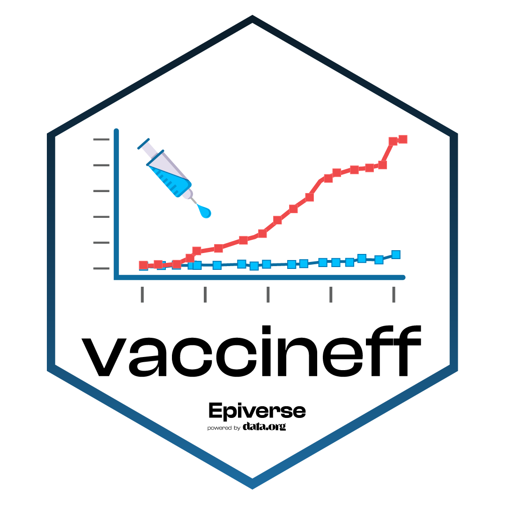

## *vaccineff*: an R package with tools for estimating vaccine effectiveness and vaccinne related metrics 

<!-- badges: start -->

[](https://opensource.org/license/mit/)
[](https://app.codecov.io/gh/%7B%7B%20gh_repo%20%7D%7D?branch=main)
[](https://www.reconverse.org/lifecycle.html#concept)

<!-- badges: end -->

**vaccineff** is an R package that offers tools for estimating the
vaccine effectiveness, using a series of epidemiological designs
(including cohort studies, test-negative case-control, and screening
methods). The package provides a set of features for preparing the data,
to analyse different study designs and for assessing the performance of
the models.

**vaccineff** is developed at [Pontificia Univeridad
Javeriana](https://www.javeriana.edu.co/inicio) as part of the
[Epiverse-TRACE program](https://data.org/initiatives/epiverse/).

## Installation

You can install the development version of **vaccineff** from
[GitHub](https://github.com/) with:

``` r
if(!require("remotes")) install.packages("remotes")
remotes::install_github("TRACE-LAC/vaccineff")
```

## Quick start

**vaccineff** provides a minimal datasets that can be used to test out
each design `(cohortdata, testnegdata, screeningdata)`

\# Load example `cohortdata` included in the package

``` r
data("cohortdata")
head(cohortdata, 5)
#>   sex age death_date vaccine_date_1 vaccine_date_2 vaccine_1 vaccine_2
#> 1   M  68       <NA>     2021-07-27     2021-12-01    BRAND2    BRAND2
#> 2   F  26       <NA>           <NA>           <NA>      <NA>      <NA>
#> 3   M  42       <NA>           <NA>           <NA>      <NA>      <NA>
#> 4   M  23       <NA>           <NA>           <NA>      <NA>      <NA>
#> 5   M  51       <NA>     2021-07-09     2021-08-10    BRAND2    BRAND2
```

### Contributions

Contributors to the project include:

-   [David Santiago Quevedo](https://github.com/davidsantiagoquevedo)
    (author)

-   [Zulma M. Cucunubá](https://github.com/zmcucunuba) (author)

-   [Santiago Loaiza](https://github.com/santilo9513) (author)

-   [Geraldine Gómez](https://github.com/GeraldineGomez) (contributor)
