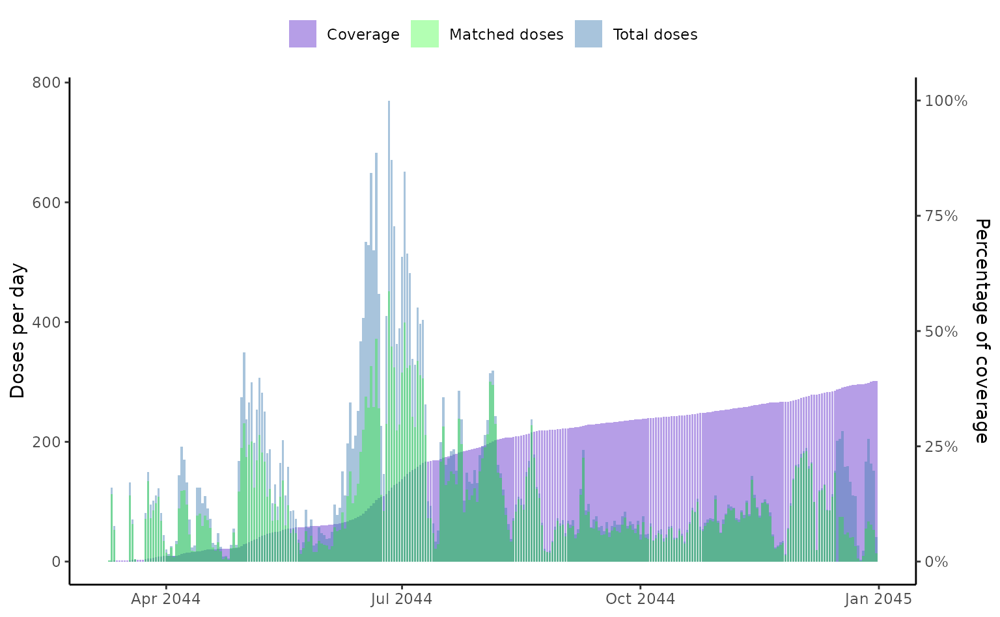
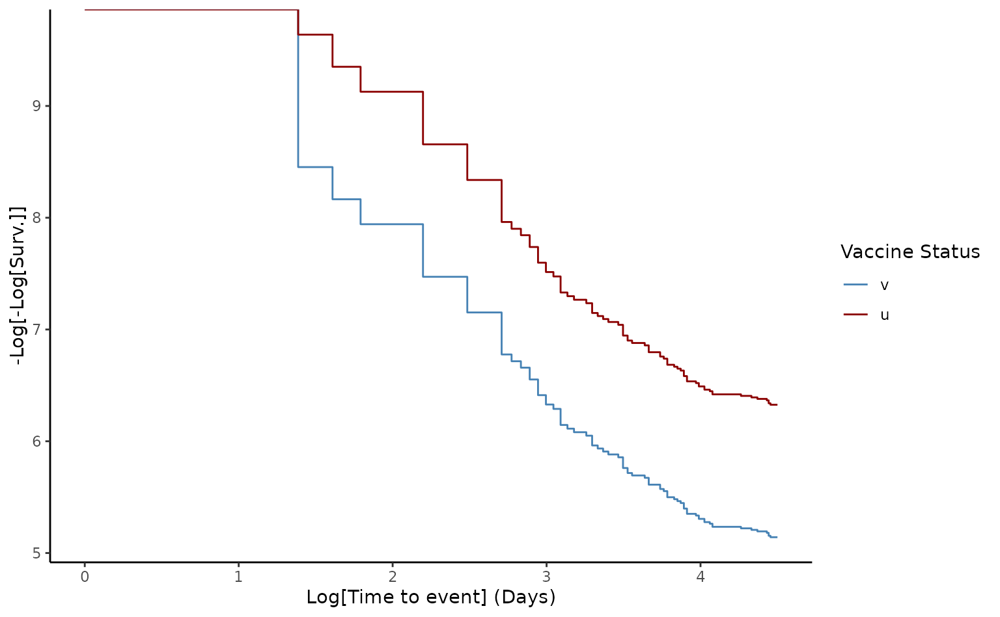

# vaccineff

``` r

library(vaccineff)
```

## Usage

Vaccines are created to offer protection against diseases that affect
human health. Quantifying how well vaccines work in controlled
environments and in real-life settings remains a challenge for
scientists. Estimating vaccine effectiveness ($`VE`$) is a key task once
a vaccine is available as a control measure within a population, such as
during the middle phase of an epidemic like Ebola or COVID-19, and also
in the evaluation of regular vaccination programs, such as childhood
vaccines.

`vaccineff` provides tools to estimate $`VE`$ under different study
designs ([Halloran et al. 2010](#ref-bookvaccine)). The package provides
a set of features for preparing the data, estimating crude and adjusted
effectiveness, controlling for potential confounders such as age and
assessing the performance of the models used to approximate $`VE`$.

## Who are the users / potential users?

`vaccineff` is useful for local, national, and international health
agencies looking for a quick implementation to estimate $`VE`$ based on
their available data. It also provides insights to researchers, data
analysts, and epidemiology students on how to approach $`VE`$ using
different methods. We believe that `vaccineff` would be specially useful
for users without advanced training in statistical methods.

## What is vaccine effectiveness?

In contrast with vaccine efficacy, which is the percentage reduction of
disease incidence in a vaccinated group compared with an unvaccinated
group under ideal conditions, $`VE`$ is the percentage reduction of
disease incidence in a vaccinated group compared with an unvaccinated
group under routine conditions. The reduction attributable to
vaccination is usually assessed from data collected in observational
studies ([Halloran et al. 2010](#ref-bookvaccine)). Evaluating the
effectiveness of vaccines in the field is an important aspect of
monitoring immunization programs.

## For which designs is this package?

`vaccineff` is a package designed to be used for any infectious disease
for which a vaccine strategy has been implemented. This current version
only allows measuring $`VE`$ for cohort study designs. Future version
will include other designs such as test-negative/case-control studies,
and the screening method ([Torvaldsen and McIntyre
2002](#ref-torvaldsen2002observational)). For more information, see the
vignette [Other
designs](https://epiverse-trace.github.io/vaccineff/articles/other_designs.html).

### Cohort Design

In the cohort design, $`VE`$ is estimated using the Hazard Ratios
($`HR`$) between vaccinated and unvaccinated populations,

``` math
VE = (1-HR(t))\times100.
```

The $`HR`$ is estimated using the Cox Proportional Hazards model. In
particular, we use the vaccine status of the individuals as the only
covariate in the regression. Other confounders can be included as
matching arguments to adjust for observational bias. The proportional
hazards hypothesis is checked using the Schoenfeld test. A visual check
is also provided using the log-log representation of the Survival
Probability. If the hypothesis is not satisfied, it is recommended to
stratify the population into smaller groups using the confounding
variables.

## What type of data is needed to use the package?

This package is designed to be used with vaccination data sets with the
following structure.

### Data for Cohort design

Data should be disaggregated at the individual level to track vaccinated
and unvaccinated populations over time. The dataset must include the
following information:

- Date(s) of vaccination for each individual: The package allows for
  multiple doses per individual and estimates the immunization date
  using delay times of outcomes and the timing of vaccine
  administration.

- Date(s) of outcome(s): The package estimates vaccine effectiveness
  against various outcomes.

- Date(s) of right censoring: The package allows for the inclusion of
  information on dates of events that constitute right censoring.

- Individuals’ demographic information (e.g., sex, age group, health
  status): These can be used as confounding variables to match the
  population and reduce observational bias.

An example dataset for a cohort design is included, with information on
vaccination dates and biological details per dose, as well as relevant
demographic information. The level of data aggregation is tailored to
the characteristics and needs of the study case. To load this dataset,
run the following code

``` r

# Load example data
data("cohortdata")
head(cohortdata)
#>         id sex age death_date death_other_causes vaccine_date_1 vaccine_date_2
#> 1 04edf85a   M  50       <NA>               <NA>           <NA>           <NA>
#> 2 c5a83f56   M  66       <NA>               <NA>           <NA>           <NA>
#> 3 82991731   M  81       <NA>               <NA>           <NA>           <NA>
#> 4 afbab268   M  74       <NA>               <NA>     2021-03-30     2021-05-16
#> 5 3faf2474   M  54       <NA>               <NA>     2021-06-01     2021-06-22
#> 6 97df7bdc   M  79       <NA>               <NA>     2021-03-21     2021-05-02
#>   vaccine_1 vaccine_2
#> 1      <NA>      <NA>
#> 2      <NA>      <NA>
#> 3      <NA>      <NA>
#> 4    BRAND2    BRAND2
#> 5    BRAND1    BRAND1
#> 6    BRAND2    BRAND2
```

## Modeling vaccine effectiveness

### VE for Cohort design

The current release of the package bases the estimation of $`VE`$ in the
cohort design on the assumption of proportional hazards between
vaccinated and unvaccinated populations. The $`HR`$ is estimated using
the Cox proportional hazards model implemented in the R package
[survival](https://github.com/therneau/survival).

The integrated dataset `cohortdata` serves as a minimal example of the
package’s input. The data is accessed using `data("cohortdata")`.

`vaccineff` has two main functions: 1. `make_vaccineff_data`: This
function returns an S3 object of the class `vaccineff_data` with the
relevant information for the study. This function also allows to create
a matched cohort to control for confounding variables by setting
`match = TRUE` and passing the corresponding `exact` and `nearest`
arguments. `make_vaccineff_data` supports the methods
[`summary()`](https://rdrr.io/r/base/summary.html) to check the
characteristics of the cohort, the matching balance and the sizes of
matched, excluded, and removed populations, and
[`plot()`](https://rdrr.io/r/graphics/plot.default.html) to plot the
cohort coverage.

2.  `estimate_vaccineff`: This function provides methods for estimating
    VE using the $`HR`$. A summary of the estimation can be obtained
    using [`summary()`](https://rdrr.io/r/base/summary.html) and a
    graphical representation of the methodology is generated by
    `plot().`

``` r

# Create `vaccineff_data`
vaccineff_data <- make_vaccineff_data(
  data_set = cohortdata,
  outcome_date_col = "death_date",
  censoring_date_col = "death_other_causes",
  vacc_date_col = "vaccine_date_2",
  vaccinated_status = "v",
  unvaccinated_status = "u",
  immunization_delay = 15,
  end_cohort = as.Date("2021-12-31"),
  match = TRUE,
  exact = c("age", "sex"),
  nearest = NULL
)

# Print summary of vaccineff data object
summary(vaccineff_data)
#> Cohort start:  2021-03-26
#> Cohort end:  2021-12-31
#> The start date of the cohort was defined as the mininimum immunization date. 
#> 65 registers were removed with outcomes before the start date.
#> 
#> Nearest neighbors matching iteratively performed.
#> Number of iterations:  4
#> Balance all:
#>               u         v         smd
#> age   63.917069 62.997438 -0.08593156
#> sex_F  0.520277  0.573474  0.10701746
#> sex_M  0.479723  0.426526 -0.10701746
#> 
#> Balance matched:
#>               u         v smd
#> age   63.751784 63.751784   0
#> sex_F  0.521457  0.521457   0
#> sex_M  0.478543  0.478543   0
#> 
#> Summary vaccination:
#>               u     v
#> All       10973 19905
#> Matched   10789 10789
#> Unmatched   184  9116
#> 
#> // tags: outcome_date_col:death_date, censoring_date_col:death_other_causes, vacc_date_col:vaccine_date_2, immunization_date_col:immunization_date, vacc_status_col:vaccine_status

# Plot the vaccine coverage of the total population
plot(vaccineff_data)
```



``` r


# Estimate the Vaccine Effectiveness at 90 days
ve90 <- estimate_vaccineff(vaccineff_data, at = 90)

# Print summary of VE
summary(ve90)
#> Vaccine Effectiveness at 90 days computed as VE = 1 - HR:
#>      VE lower.95 upper.95
#>  0.6943   0.4889   0.8172
#> 
#> Schoenfeld test for Proportional Hazards assumption:
#> p-value = 0.027
#> Warning:
#> 
#> p-value < 0.05. Please check loglog plot for Proportional Hazards assumption

# Loglog plot to check proportional hazards
plot(ve90, type = "loglog")
```



For details on the estimation of VE in cohort studies see the vignette
[Introduction to cohort design with
vaccineff](https://epiverse-trace.github.io/vaccineff/articles/cohort_design.html)

## Key references

Halloran, Elizabeth, Ira Longini, and Claudio Struchiner. 2010. *Design
and Analysis of Vaccine Studies*. Springer.

Torvaldsen, Siranda, and Peter B McIntyre. 2002. “Observational Methods
in Epidemiologic Assessment of Vaccine Effectiveness.” *Communicable
Diseases Intelligence Quarterly Report* 26 (3).
